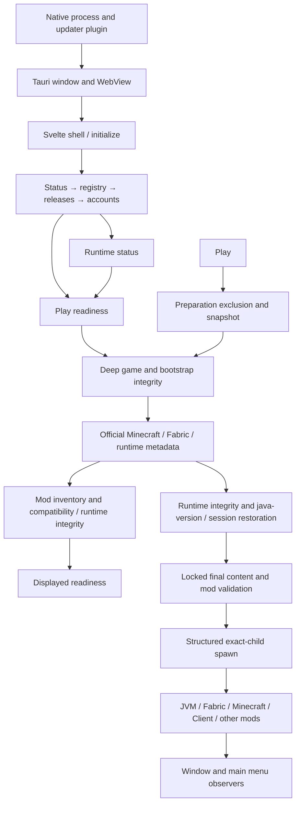

# Aurora Performance P0 — research and profiling

Research date: 2026-10-08 (owner timezone: America/New_York). **Verdict: PARTIAL.**
This is a research deliverable and an owner-review gate, not an optimization pass.

## Executive summary

The current source contains expensive repeated validation paths, but the available
evidence does not justify claiming that five independent bottlenecks dominate the
complete user experience. Fresh native measurements and a bounded live JVM recording
are below. End-to-end startup, selection, Play, artwork completion and Minecraft
loading remain unmeasured. Do not substitute native function duration for those UI
boundaries, or add overlapping measurements together as independent costs.

The strongest narrow implementation candidate is removing the duplicate SHA-256
read of provider-managed JARs **inside one inventory scan**, retaining a fresh full
digest and every ownership/path/launch check. The higher potential opportunity is
coalescing redundant readiness requests: startup/selection starts runtime status and
readiness separately, and successful runtime status starts readiness again. Its
actual request count and end-to-end benefit need packaged IPC measurements first.

Installed artwork is already corrected at this HEAD. Recommending the former WebP
fix, provider identity recovery or request coalescing as new work would be wrong.
Warm disk image decode cost and residual repeated inventory work are still worth
measuring; the correction's security bounds and worker isolation must remain.

Existing installation evidence already supports pooled HTTP clients, bounded
16-way acquisition and eight staged-hash workers. Those changes are implemented.
The cold installation network result in `INSTALL_PERFORMANCE.md` is historical,
not a fresh baseline of this HEAD. No heap-size or JVM-flag recommendation is
supported by this phase.

## Repository identity and protection

| Repository | Investigated HEAD | Branch | Remote comparison |
|---|---|---|---|
| Launcher | `fad40125f8fd87b8fa0893c97827e8e4a890081b` | `codex/client-3-production-authority` | No upstream; 2 ahead / 0 behind cached `origin/main` |
| Client | `5bdf3aa30bc7bfa9a226170a9c54ca5ec3fd8e1d` | `codex/unified-theme-pilot` | 0 ahead / 0 behind its tracking branch |

Live read-only remote HEAD queries returned Launcher `origin/main` at
`4575a0e3f1c28da6cfe072948fe91b60eeaf608f` and Client `origin/master` at
`d8eecd89b9187619b3ad7a47adf97cd74d4f1c77`. The Client tracking branch and
remote default branch are different comparisons. No fetch, push or publication ran.

The protection baseline records all 396 Launcher tracked files and 15,143
pre-existing untracked files, and all 422 Client tracked files plus four untracked
Python bytecode files. It includes SHA-256, size, status, branch, history and remote
state. Launcher developer diagnostics, `.zcodeignore`, and the oddly named existing
root diagnostic remain protected. Full local inventories are intentionally not
part of the shareable evidence; they contain developer paths.

Both repositories' root documentation was inspected against executable code.
These documents contain lengthy historical snapshots: historical claims of clean
`master`, disabled production distribution, no deletion, or missing authentication
must not override current code and the owner's research constraints. Current code
supports NeoForge, production update authorities, schema-5 instance records and
explicit deletion policies. No such behavior is changed here. The Website was not
inspected or modified.

The preparation script snapshots 11,820 files in the measured instance's game,
mods, resource packs and shader packs, plus registry/configuration and ownership
documents. It copies only game content, verified Aurora/Fabric API artifacts and
non-secret release/ownership documents into a newly allocated OS-temporary minimal
benchmark root. It copies no accounts, credentials, worlds, logs, options, server
lists or user configuration. The owner's installation is read-only. No cleanup
or recursive deletion ran. Final protection verification is linked below.

## Performance architecture map

### Startup and selection — Launcher ownership

`src-tauri/src/main.rs` first recognizes the bounded WebP worker mode; ordinary
startup calls `lib::run`. `lib.rs:49` initializes the updater plugin before setup;
setup removes Windows decorations, attaches native activity handling, loads
configuration for optional Discord, then enters the application event loop.
Configuration and registry filesystem work is synchronous. Discord connection
work belongs to its worker; optional failure does not authorize or block Play.

`src/routes/+page.svelte` mounts the shell, starts `launcher.initialize()` and
`updates.initialize()`, and subscribes to Rust events. `store.svelte.ts:233` loads
application status, launcher state, release list and accounts sequentially. After
registry loading it starts runtime status; account loading starts readiness and
avatar work. `updates.svelte.ts` separately refreshes launcher state and schedules
one optional startup update check. Shell first paint, data readiness and Play
readiness are distinct milestones; a sequential initializer does not prove the
shell is blocked throughout it.

`store.svelte.ts:681` selects through Rust, reloads state, then launches runtime
status and readiness independently. `runRuntimeStatus:741` starts readiness again
on success. `refreshPlayReadiness:331` uses a serial plus instance/account identity
to reject obsolete presentation results; it does not cancel native hashing or
network work already started. Runtime status lacks the same request-identity
publication guard. Investigate that correctness seam before changing scheduling.

### Readiness and launch — Rust authority

`application.rs:5424` loads the registry, checks installation/configuration state,
calls `resolve_instance_launch_plans`, scans mods, validates compatibility, validates
the exact runtime, and checks account/session state. Account readiness is a local
status check; it is not itself the Play refresh-token exchange.

`instances/lifecycle.rs:1229` resolves the game and runtime once per invocation.
`resolve_instance_game_plan` first deeply validates installed content, then rebuilds
the exact normalized plan from official metadata. For Fabric this includes Mojang
manifest + SHA-1-verified version document, Fabric Loader list + exact profile,
and Mojang runtime index + expected-SHA-1 runtime manifest. Runtime manifests use
the verified cache; discovery and Mojang/Fabric document resolution are still
network-dependent. A populated artifact cache does not make the whole readiness
path offline. There is no evidence supporting a network-free readiness claim.

`install/mod.rs:749` iterates every installed manifest file serially, verifying
size and the recorded trust-class digest; then it checks natives presence.
`runtime/install.rs:380` synchronously verifies state, each file, directories,
links and executable semantics inside an async function before optional diagnostic
execution. Mod scanning in readiness and Play is also synchronous on the async
call path. Inventory commands explicitly use `spawn_blocking`; these readiness
substeps do not. This is a scheduling concern, not proof of a frozen UI.

Home calls the single `play_instance` path. Workspace Play first requests readiness
and then enters it. `application.rs:5572` acquires process-local preparation
exclusion, captures installed/configuration state, resolves plans with deep
validation, scans compatible mods, validates Java including bounded `-version`,
and obtains a usable Rust-only session. Session reuse honors expiry; restoration
serializes refresh redemption and immediately persists rotation to the OS store.

`launch/boundary.rs:76` locks instance content and registry, rechecks the captured
state, repeats complete-instance validation, and executes a synchronous callback
that repeats compatibility checks, resolves arguments and reserves/spawns the
exact child. These final checks protect against changes during preparation.
They are not removable redundant UI checks. `launch/resolve.rs` builds the ordered
classpath from normalized plans and manifest roles, keeps the client last and
substitutes real native session/managed-path placeholders into individual strings.
`launch/process.rs` supervises only the returned handle, drains bounded/redacted
streams and emits state changes. `Running` means spawn succeeded, not menu ready.

### Installed content and artwork — Launcher ownership

`instance_mods::scan:211` enumerates safe direct children, loads provider/bootstrap
ownership, hashes JARs, inspects bounded Fabric/NeoForge metadata and declared
nested modules/mixins, derives dependencies/warnings and sorts entries. It never
executes archives. Provider records use a linear search per child, which could
matter at larger sizes but is unmeasured here.

`instance_mods.rs:777` verifies a provider JAR by SHA-256;
`:817` separately calls `file_digest` to build the entry revision. Therefore a
valid provider-managed JAR is fully SHA-256 read twice in this single scan, before
separate ZIP/nested metadata reads. Bootstrap/retained ownership can add further
verification. Total scan time includes hashing, archive inspection, ownership and
sorting; it is not a measurement of either hash pass alone.

`instance_content::scan:1077` enumerates resource/shader packs, reads bounded
ZIP metadata or direct folder structure, hashes managed ZIPs for ownership and
sorts. Folder packs remain local. Shader presence does not prove a shader loader
exists. Provider lifecycle is separately requested by installed panels and
performs its own local verification. User-triggered recognition separately scans,
hashes eligible candidates and batches exact-file Modrinth lookup (64 hashes per
batch). It does not adopt anything without approval/revalidation.

Installed panels keep inventories in the launcher store and filter/sort snapshots
in Svelte rather than scanning on each keystroke. Rows are keyed; no virtualization
is implemented. Those maps and settings drafts have no explicit global eviction
bound; that is a retention hypothesis for many instances, not a measured leak.
Browse serials ignore obsolete responses; ignoring does not necessarily cancel
provider work. Details/update/recognition are explicit work rather than idle polling.

The artwork correction adds another local inventory scan inside
`installed_artwork::candidates:122`. Verified provider identities bypass remote
recognition. Otherwise regular candidates are SHA-256/SHA-512 read in one pass and
resolved through exact published file hashes and project-type checks. Positive
receipts survive restart; authoritative no-match expires in one hour; transport
failures use a one-minute process deadline. Up to 256 candidates/512 MiB each are
considered; persisted receipt reuse still requires identifying current bytes.

`artwork::resolve_with:237` serializes the same project, decodes/revalidates positive
disk hits, bounds missing-image acquisition to four slots and negative memos to
128 entries. Canonical PNG disk hits do not require a WebP worker or network.
Legacy valid WebP may convert once; fresh WebP uses an exact supervised memory-
limited worker. The shared frontend promise caches cap 128 entries, coalesce
in-flight work and expire results at ten minutes or the retry deadline; unmounted
consumers stop timers and ignore stale results. There is no positive native decoded
pixel cache. Re-decoding after frontend expiry is an opportunity only if measured
cost justifies bounded retention and byte-based invalidation.

`INSTALLED_ARTWORK_RELIABILITY.md` reports prior packaged acceptance: 32/32 usable
images displayed; repeating Mods navigation added zero artwork calls. That is
existing acceptance evidence, not a fresh P0 request-count trace. No artwork fix
is attempted here, and unavailable artwork is excluded from readiness authority.

### Downloads, installation and updates — Launcher ownership

`downloads.rs:797` reuses HTTP clients by exact transport options and Tokio runtime
identity. Artifact bodies stream and hash into unique staging, then verified
content-addressed objects are promoted. SHA-1, SHA-256 and transport-observed trust
remain distinguishable. Cache hits rehash bytes; filenames never confer trust.
Requests have bounded connect/idle timeouts and controlled redirects.

`install/mod.rs:367,448` and `runtime/install.rs:200` acquire independent items in
chunks of 16; each chunk settles before the next. Stragglers can leave slots unused,
but no fresh trace quantifies that. Materialization copies isolated bytes and
`install/mod.rs:1186` uses eight blocking staged verification workers. Manifest-last
directory promotion and rollback remain mandatory. The installed validation loop
is a different, serial path. Progress events occur per completed acquisition/copy;
event pressure is unmeasured, so batching/throttling is conditional.

Modpacks are a separate exact `.mrpack` pipeline (`mrpack`, `modpacks`, `pack_state`,
`pack_update`). It verifies archive/files, inspects/reconciles provider identities,
checks overrides and records pack ownership. `modpacks.rs:329,350` acquires pack
external/provider files sequentially before instance preparation; ordinary game
acquisition remains bounded. This narrower possible waterfall should be profiled
with a real pack rather than assumed identical to the optimized game installer.
Update planning checks fingerprints and local inventory again before transactional
activation, preserving user edits and pack ownership.

`content_updates::check_updates:128` performs explicit per-retained-project
discovery sequentially, skips dependency-managed records, verifies local bytes,
and stops subsequent provider requests on rate limit. It can migrate legacy
provider state, so this command is not suitable as a guaranteed no-write benchmark
without an isolated root. Client/Launcher update discovery is a separate manual
authority path with one optional startup check; signed Launcher installation and
verified Client activation remain unchanged.

### Minecraft and Client ownership

After spawn, JVM class loading/JIT/GC, Fabric discovery/mixin initialization,
Minecraft resource reload, third-party mods, resource packs and shaders own the
remaining startup. Launcher scheduling cannot directly shorten those stages.

Client `AuroraClient.java:26` initializes the optional event-driven bridge, loads
configuration and active profile, runs migrations, registers keys/features/HUD
and lifecycle callbacks. Configuration/profile loading occurs on the initialization
thread. Save writers and world-map storage have their own workers; the bridge has
a bounded daemon queue and no render/tick network polling. `CLIENT_STARTED` can
provide an authenticated lifecycle milestone, but MAIN_MENU also describes absence
of a level and occurs on disconnect; it is not a universal first-frame/menu-ready
clock. Use a visible menu observer plus the lifecycle marker.

The Client has bounded native texture caches, font/icon work, static shape caches,
and live backdrop capture/readback. The latest documentation records parent-only
capture for main/detail screens and retained five title cards. Historical
per-row/glass timing cannot establish a current startup bottleneck. In-game
Modrinth artwork is a separate Java HTTP/texture cache, not Launcher's disk cache.
No Client source or third-party mod is changed.

## Baseline methodology and results

### Machine and sample conditions

Windows 11 Home `10.0.26300`; Intel i7-14700F, 28 logical processors, 31.76 GiB RAM;
MSI M461 1 TB NVMe SSD. Rust `1.98.1`, x86_64 MSVC. Other work and two Java processes
were running, including the exact Minecraft child of the installed Launcher.
No power, thermal, antivirus, GPU or background-load control was established.

The production-profile isolated Rust harness directly links the current native
library; it does not initialize Tauri or call installation, account, selection,
update or game-spawn APIs. Release settings match the Launcher: optimization 3,
LTO, one codegen unit, abort-on-panic and stripping. The host linker required an
explicit genuine MSVC CRT library because a newly generated Tauri dependency
output contained an invalid 82-byte `msvcrt.lib` that shadowed the normal library.
This was handled only in harness linker arguments; no production build script,
toolchain, generated file cleanup or dependency update was made.

Protection hashing and creating the minimal copy already warmed filesystem data.
**No disk-cold results are claimed.** Native sample 0 is first observed in the
benchmark process; repeated samples are filesystem-warm, under uncontrolled
background load. Artifact/metadata caches were already populated. Local validation
requires no downloads; optional online resolution is reported separately and may
populate only reconstructable metadata caches, never instance content.

Timers use Rust `Instant`. They include result/fact assembly before the elapsed
sample and exclude subsequent stdout serialization/writing. Very short pack
results may include measurable harness overhead. No calibrated overhead subtraction
is applied; no production instrumentation or persistent telemetry is introduced.
The harness is not a measurement of IPC, frontend render or complete readiness.

### Observed native baseline

All durations below are milliseconds. Each local series contains one first call
plus 20 repeats. Online plan/runtime series contain one first call plus four
repeats. p95 is the nearest-rank empirical repeat percentile; `—` means insufficient
samples. The last two rows belong to a separate online process, not the local-only
typical series. Its additional local trials remain separately labeled in the JSON.

| Configuration / stage | First | Repeats | Repeat p50 | Repeat p95 | Worst repeat | Repeat SD | Workload / result |
|---|---:|---:|---:|---:|---:|---:|---|
| Small: game integrity | 517.96 | 20 | 624.64 | 698.61 | 706.31 | 61.45 | 4,677 manifest files; 556,755,619 bytes; valid |
| Small: complete instance | 457.04 | 20 | 657.09 | 728.28 | 732.71 | 64.62 | Ready; zero problems; includes game verification |
| Small: mods scan | 31.18 | 20 | 45.33 | 51.98 | 55.41 | 6.22 | 2 JARs; 5,503,416 bytes; zero missing |
| Small: resource-pack scan | 0.72 | 20 | 1.08 | 1.29 | 1.29 | 0.23 | Empty; zero missing |
| Small: shader-pack scan | 0.56 | 20 | 0.92 | 1.25 | 1.28 | 0.22 | Empty; zero missing |
| Typical: game integrity | 694.24 | 20 | 1,060.60 | 1,091.61 | 1,092.03 | 94.76 | Same 4,677 files / 556,755,619 bytes; valid |
| Typical: complete instance | 887.15 | 20 | 1,328.87 | 1,409.04 | 1,438.58 | 89.12 | Ready; zero problems; includes game verification |
| Typical: mods scan | 188.61 | 20 | 301.24 | 316.89 | 336.14 | 12.34 | 31 entries; 33,201,203 bytes; zero missing |
| Typical: resource-pack scan | 30.96 | 20 | 46.53 | 49.60 | 50.80 | 5.06 | 3 entries; zero missing |
| Typical: shader-pack scan | 4.87 | 20 | 8.13 | 9.17 | 9.97 | 1.40 | 1 entry; zero missing |
| Shared: disk artwork decode/re-encode batch | 49.72 | 20 | 46.45 | 48.60 | 49.32 | 1.97 | 42 canonical PNGs; all 42 available |
| Typical online: launch plans including integrity | 2,062.13 | 4 | 1,209.27 | — | 1,379.39 | 145.64 | 5/5 succeeded; exact official plans; excludes runtime audit |
| Typical online: runtime integrity, no Java diagnostic | 115.16 | 4 | 130.05 | — | 169.52 | 31.48 | 402 files; 99,041,788 bytes; ready |

The raw observations, min values and sample variance in ms² are retained in the
aggregate. The initial eight-trial pilot processes overlapped; their sanitized
observations are preserved as `pilot-*.jsonl` but excluded from this table and
the aggregate. Final configurations ran sequentially, after compilation completed.
The final native workload processes did not overlap one another, compilation,
protection hashing or the JFR recording.

The same game bytes produced different timings under the owner and disposable
roots. Background load, antivirus/path effects and ordering were uncontrolled;
this is **not** evidence that removing mods accelerates game-file hashing. Several
first calls were faster than repeats. Warm does not mean faster under these
conditions. Do not subtract unmatched medians to infer the network or bootstrap
subcost, or claim a causal improvement from the small/typical comparison.

First calls are retained in `summary.json` separately. p95 is intentionally absent
for fewer than 20 repeated trials. A small empirical percentile is not a population
tail estimate. Standard deviation is sample standard deviation; trials are serial
and correlated, so these data are exploratory rather than a controlled causal A/B.

The minimal instance is a disposable derivative of the same actual installed game
and two SHA-256-checked required JARs. It is a validation workload, not a newly
launched installation. The typical instance uses the owner's actual content.
No representative large instance or installed modpack was available. Duplicate
JARs and artificial filename copies were not used to invent one.

### Resource observation

Six approximately ten-second observations of the installed 1.4.1 Launcher and its
six WebView2 descendants found a stable seven-process tree, **0 recorded CPU-time
increment** at Windows accounting precision, about 525.43–525.54 MiB summed working
set and 440.37–440.48 MiB private bytes, 4,939 handles and 218 threads. Shared pages
can be counted more than once in summed working sets. Minecraft is excluded.
The installed binary hash is
`15bfd5d71bbe73c9ad7f3010c052f3f1669d81abfa4790b8c48efb8b169fd868`,
which differs from the current local release payload. UI visibility/state was not
controlled and compilation/background Minecraft were active. Therefore this is an
existing-binary resource observation, **not a current-HEAD idle CPU/leak baseline**.
The retained `.zcode-perf` Phase-F comparisons are historical and not pooled with it.

## Profiling evidence

### Live JVM recording

The 45-second bounded recording attached to the exact Java child identified by
parentage under the running Launcher. It did not restart or terminate Minecraft.
JDK 25 diagnostic tools successfully attached; the application requirement is Java
21, and the existing child executable's Windows version resource reports
`21.0.7.0`. A future controlled series should use matching Java-21 tools and
record full runtime build provenance. Current Client source HEAD and the deployed Client 3.0.0 JAR
are not assumed to be identical revisions.

Only execution samples (20 ms configured period), allocation samples (50/s throttle),
GarbageCollection and GCPhasePause were explicitly enabled from `settings=none`.
The initial pilot audit caught default custom Minecraft FPS/tick/network-summary
events. Their payloads were never exported. The replacement explicitly disables
all 16 registered custom event types found in that audit, and the aggregator refuses
nonzero custom events. This matters because custom JFR events can be enabled by
default ([JDK event defaults](https://docs.oracle.com/en/java/javase/21/docs/api/jdk.jfr/jdk/jfr/Enabled.html)).
Final event summary confirms zero custom, JVMInformation, initial environment/
system-property, ProcessStart, file read/write and socket events. Both raw recordings
stay in the disposable temporary root; the initial pilot is excluded from conclusions.
The repository receives only aggregate class/method counts and pause durations.
Thread names, process arguments, paths, servers and user identity are not exported.

The replacement contains 237 execution samples, 2,051 allocation samples, 19 GC events
and 24 pause events. `Arrays.fill` is the leaf of 49/237 execution samples; a third-party
skin-layer compile method appears in 21. Aurora HUD rendering appears in 19
inclusive samples and world-map capture in four. Inclusive frames overlap and must
not be summed as separate time. Innermost Aurora allocation callers include Armor
HUD rendering (21 events) and Potion timer drawing (19). These identify follow-up
targets in live gameplay, not loading bottlenecks or exact CPU percentages.

The 24 observed GC pause events total **72.22 ms**, with median **2.61 ms**,
nearest-rank empirical p95 **6.12 ms**, and maximum **6.72 ms**. That percentile
describes these events only; no frame-time attribution or general tail claim follows
from this uncontrolled recording. This is recorded pause-event duration, not the total time
spent doing all concurrent GC work.

Allocation `weight` is a sampling estimate; large weights can include recording-
start/sampling effects. This report does not convert them to a claimed allocation
rate or infer a leak. The workload was uncontrolled and does not supply FPS/frame-
time measurements or a before/after overhead control. GC pauses can affect a frame,
but neither heap expansion nor a collector change follows from this single trace.
Recording overhead is uncalibrated; this capture is explicitly isolated from
unprofiled native trials and is not used to assert a production latency target.

### Other profiling tools and applicability

| Technique | Actual Aurora use / limitation |
|---|---|
| ETW/WPR/WPA CPU sampling and File I/O | Attribute deep-validation wall time to hashing, many small opens, storage wait, antivirus or scheduler; include only selected process intervals and sanitized exports. WPR exists, no session was active; caller is not elevated and WPA is not installed. No ETW/flamegraph is claimed. [Microsoft WPR](https://learn.microsoft.com/en-us/windows-hardware/test/wpt/windows-performance-recorder). |
| Process Monitor | Exact path/process-filtered read/open counts can test the duplicate JAR pass and install I/O amplification. Retain raw paths locally; export counts and aliases only. Not captured in P0. [Official tool](https://learn.microsoft.com/en-us/sysinternals/downloads/procmon). |
| Rust timing spans | If external tools cannot distinguish overlapping readiness jobs, gate request/queue/hash/metadata/runtime/final-boundary spans in a separate development patch. Use enums/counts and ephemeral correlation numbers, `skip_all`, no argument/return/error-body logging. Instrument futures rather than holding an entered guard across await. Measure overhead in paired runs. [Span rules](https://docs.rs/tracing/latest/tracing/struct.Span.html), [instrument fields](https://docs.rs/tracing/latest/tracing/attr.instrument.html). |
| WebView performance and heap profiles | Record actual packaged WebView IPC completion, first content paint, image decode, long tasks and retained DOM/listeners after navigation. A normal browser preview cannot benchmark Rust or WebView startup. WebView has multiple processes; one process's memory is insufficient. [Microsoft guidance](https://learn.microsoft.com/en-us/microsoft-edge/webview2/concepts/performance), [DevTools timeline](https://developer.chrome.com/docs/devtools/performance). |
| JFR, allocation/GC and class loading | Start a bounded safe event allowlist before disposable Play to separate Fabric init, reload and post-start GC; aggregate sampled stacks by JVM/Minecraft/Client/other-mod ownership. Add class-loading events only in the controlled startup run. No fashionable flags. [JDK configurations](https://docs.oracle.com/en/java/javase/21/jfapi/flight-recorder-configurations.html), [jcmd](https://docs.oracle.com/en/java/javase/21/docs/specs/man/jcmd.html). |
| Async scheduling | Move proven long synchronous hashing/ZIP work to bounded blocking jobs; measure queue wait and responsiveness. Started `spawn_blocking` work cannot simply be aborted; cancellation must be cooperative between bounded chunks and before publication. [Tokio contract](https://docs.rs/tokio/latest/tokio/task/fn.spawn_blocking.html). |
| Bounded rolling acquisition | Existing 16-item batches are already bounded. A rolling window may remove straggler gaps, but must settle errors, preserve deterministic manifests, rate limits and verification. No new number of workers is recommended. [Buffer semantics](https://docs.rs/futures-util/latest/futures_util/stream/trait.StreamExt.html#method.buffer_unordered). |
| UI virtualization | Only if large-list traces show DOM/layout dominates; preserve keyboard focus, expanded details, lazy artwork and filtering. Keyed lists are already present. It cannot reduce native hashing. [Svelte best practices](https://github.com/sveltejs/svelte/blob/main/documentation/docs/07-misc/01-best-practices.md). |

## Measured cost versus suspected bottlenecks

The largest separately observed native costs are game-file verification, mod
inventory and runtime-file verification, in that order for the typical workload.
The report cannot honestly supply five independently verified user-impact
bottlenecks. Ranked evidence and implications are:

1. **Deep installed-game verification is the largest measured local component.**
   It hashes 556.76 MB across 4,677 recorded files at 1,060.60 ms typical repeat
   median / 1,091.61 ms empirical p95. Complete-instance validation is 1,328.87 ms
   median and contains that work. Readiness, launch preparation and the locked
   final launch audit reach this component. Actual UI multiplicity and CPU-versus-
   storage attribution remain unmeasured. Never remove the final audit.
2. **Mod inventory is a material local cost with a specific duplicate-read seam.**
   A 31-entry, 33.20 MB scan takes 301.24 ms median / 316.89 ms p95. Source proves
   provider-expected SHA-256 verification followed by another full SHA-256 read
   for entry revision in the same entry path. ZIP/nested/mixin parsing and
   bootstrap/provider checks also contribute; the duplicated pass's isolated
   duration is unknown. This supports a narrow mechanism test, not a 301 ms
   savings promise.
3. **Exact runtime verification adds observed work.** Five successful audits
   check 402 files / 99.04 MB, with four-repeat median 130.05 ms and worst repeat
   169.52 ms. No `java -version` child ran in these trials. Its cost in actual Play,
   authentication refresh and executor queue wait are separate unmeasured steps.
4. **Online plan preparation has measurable inclusive latency, but overlaps the
   first finding.** First call is 2,062.13 ms and repeat median 1,209.27 ms. It
   includes complete-instance hashing plus official discovery/plan resolution,
   excluding the subsequent runtime audit. There is no timing span per request,
   so neither a pure network cost nor a fourth independent bottleneck is proven.
5. **Pack scans and positive artwork decode are smaller sampled costs.** Three
   resource packs take 46.53 ms median; 42 cached PNGs take 46.45 ms as a batch;
   one shader pack takes 8.13 ms. This workload provides no reason to put image
   decode or shader inventory ahead of integrity/mod work. Remote recognition,
   missing-image retries and DOM/image paint were not measured.

The uncontrolled installed-binary resource tree uses about 440 MiB private bytes,
but does not establish a leak or identify removable allocations. JVM HUD/world-map
stacks are follow-up attribution, not evidence for a Launcher startup bottleneck.
Source-confirmed duplicate readiness triggers increase the opportunity for repeated
work; without packaged invocation counts their saved latency remains an estimate.

Structural facts with a current cost measurement are stronger than speculation,
but function cost alone does not establish how often a user waits for it. Readiness
and launch contain game-integrity cost; do not rank their inclusive totals alongside
it as independent bottlenecks. Current UI request multiplicity, network phase
breakdown, disk wait attribution and loading ownership need the next controlled run.

## Optimization opportunity matrix

Classes: **A** high potential impact/narrow risk; **B** architectural; **C** moderate;
**D** unsupported or rejected. Impact remains conditional where UI evidence is missing.

| Rank / class | Subsystem, evidence and current cost | Proposed mechanism / estimated benefit | Risk, complexity, confidence / owner |
|---|---|---|---|
| 1 / A candidate | Mod inventory; verified second SHA-256 pass at `instance_mods.rs:777,817`; scan cost in native table; isolated per-pass cost unknown | One current bounded digest read proves provider expectation and supplies revision. Estimated benefit: cost of one provider-JAR read/hash per scan; no percentage promised | Ownership/race semantics; low–medium complexity; high code confidence, benefit unmeasured; Launcher |
| 2 / A candidate | Startup/selection/runtime completion; `store.svelte.ts:242,257,681,741`; total UI cost unmeasured, native integrity lower-level cost measured | Coalesce equal in-flight readiness requests and schedule a required follow-up after a real mutation; eliminate known redundant triggers only with generation-aware state. Estimated benefit: duplicate request cost, not faster final audit | Stale account/instance/config/runtime publication; medium complexity; high structural confidence; Launcher |
| 3 / B | Serial deep game verification and synchronous work in async readiness; `install/mod.rs:749`, `runtime/install.rs:380`; native table | Bounded blocking verification jobs; optionally reuse the install validator's execution pattern with deterministic ordering and bounded memory. Estimated benefit: less executor occupation; wall-clock change requires 1/2/4/8-worker storage trials | Task storms, error ordering, final lock duration, cancellation; medium–high complexity; measured path cost, scheduling benefit unmeasured; Launcher |
| 4 / B | Repeated official plan discovery; `lifecycle.rs:1229`; online inclusive result if available, request subcost unknown | Exact-plan preparation/coalescing and eventually provenance-aware metadata persistence. Use expected SHA-1 documents, exact loader/OS/arch/release policy; explicitly define discovery freshness | Offline policy, remote drift, malformed/new schema, stale Java identity; high complexity; current repeated network path confirmed; Launcher |
| 5 / C | Inventory → provider lifecycle → artwork candidates repeat local work; panel and `installed_artwork.rs:122`; aggregate extra cost unmeasured | Share an immutable scan result only within one requested cosmetic transaction, keyed by full byte revision and parser/loader policy. Do not grant provider ownership from cached artwork | External edits, disabled files, changed ownership; medium complexity; high structural / low benefit confidence; Launcher |
| 6 / C | PNG disk-hit decode/re-encode; `artwork.rs:132`; batch cost in table | Bounded positive validated-pixel memo only if cold/warm decode traces justify it. Changed cache bytes must be revalidated; invalid bytes stay unavailable. Estimate: avoided repeat decode cost only | Pixel memory, corrupt replacement/invalidation; medium complexity; current sampled cost known; Launcher |
| 7 / C conditional | Game/runtime 16-item batches; sequential pack/update discovery; source refs above; fresh timing unmeasured | Measure batch-tail gaps and actual pack/update request counts, then bounded rolling work where rate-limit/cancellation policy permits | Request pressure, outstanding writes, mixed error order, stale pack previews; medium–high complexity; low benefit confidence; Launcher |
| 8 / C conditional | Frontend inventories/drafts, many keyed rows; memory and large-list cost unmeasured | Evict proven unused presentation snapshots or virtualize only after heap/layout traces | Focus loss, unsaved draft/data loss, retry churn; medium complexity; low confidence; Launcher |
| 9 / C research | HUD/world-map stacks and allocation callers in bounded JFR; no loading or frame-time cost | Controlled world/scene A/B with frame-time histogram, allocation/GC trace and source symbol mapping; then a separately reviewed Client pass | Gameplay/render parity and world-map correctness; medium–high complexity; sampled attribution only; Client |
| 10 / D | Heap flags, disabling checks, hard-linking caches, speculative rewrite | Reject or defer; no safe measured mechanism supporting them | See rejection list; both repositories |

Each candidate's implementation must have these specific validation and rollback rules:

| Candidate | Required tests / acceptance evidence | Rollback / Windows and Linux implications |
|---|---|---|
| One-pass mod digest | Valid/modified/missing/disabled/provider/bootstrap/local/nested JAR fixtures; same entry revision and ownership; corrupt bytes refuse authority; ZIP limits unchanged; count reads on a disposable managed fixture | Revert the isolated scanner commit; structured Windows reparse/share rules and Linux link/path rules must both remain tested |
| Readiness coalescing | Deterministic command counts, rapid instance/account switch, config/content changes while pending, failure then retry, process exit, Java install and explicit Check; obsolete results cannot enable Play | Revert scheduling alone; no OS-specific trust cache; Linux auth blockers remain honest |
| Blocking/bounded validation | Same damage report/order at worker counts, corrupt/truncated/path-escape state, bounded memory/tasks, same-instance mutation races and final lock/spawn exclusion | Revert worker executor, retaining manifests/DTOs; SSD/HDD and Windows antivirus/link semantics differ from Linux, so rerun both |
| Exact metadata reuse | Offline/expired discovery, changed runtime manifest, wrong loader/version/platform, official digest corruption, unknown schema, conflicting authority; zero speculative migration | Revert cache use and keep fetch-on-demand; never silently choose system Java or another arch on either OS |
| Cosmetic scan/pixel reuse | Changed same-size bytes, ownership/provider state, expiry, corrupt cache, rapid navigation, unavailable icon, unsupported images, memory cap and stale completion tests | Revert cosmetic cache only; Windows worker Job Object and Linux address-space enforcement remain unchanged |
| Network scheduling | Loopback delay/straggler/corruption/rate-limit/error fixtures, active-request upper bound, deterministic plan order, complete settle/rollback; real pack measurement separately | Revert scheduling, retain verified stores and ownership; no portable promise of a universal concurrency optimum |
| Client follow-up | Fixed scene, enabled mods/packs/shaders, frame-time p50/p95/worst, measured profiler overhead, existing renderer/world-map tests and pixel/gameplay parity | Separate Client commit; native/GPU/driver behavior requires both Windows/Linux evidence |

## Safe reuse and invalidation rules

| Fact | Permitted reuse | Must invalidate / must never infer |
|---|---|---|
| Byte digest obtained in this scan | Compare that same full current read to the provider expectation and derive revision; keep final spawn audit separate | Changed file handle/bytes, path/ownership/state; timestamp/size alone never proves integrity |
| Parsed mod/nested/mixin metadata | Key by a freshly verified full content digest plus parser policy and loader family; re-evaluate predicates against current MC/Loader/Java | Digest, parser limits/version, loader family, Java/MC/version requirements or enabled inventory changes |
| Coalesced readiness result | Presentation for the same instance/account/generation and process state from an in-flight operation | Any actual content/config/account/runtime/process transition; mutation during work schedules fresh checks; never becomes launch authorization |
| Normalized game/runtime plan | Native-only exact pins/platform/metadata-digest/provenance and explicitly reviewed freshness policy | Loader/game/arch/component/manifest/authority-policy change; bootstrap HTTPS success is not a digest; plan reuse never replaces installed file hashing |
| Verified artifact store object | Reuse only after required byte hashing, including corrupt-cache full reacquisition | Filename/mtime/address alone is insufficient; user-writable store objects are not assumed immutable |
| Installed artwork receipts/pixels | Cosmetic only; existing hash-keyed receipts and bounded safe pixels | Changed content/cache bytes, source/ownership, negative expiry, decode failure; never grants mod management rights or Play readiness |

Cheap status can tell the UI that checks are pending or an installation is missing;
it cannot assert secure readiness. A background audit may prepare work, but elapsed
time and a stored `ready` flag cannot replace the final locked audit. A process-local
generation counter does not detect arbitrary external edits. Any architecture that
skips launch hashing based solely on watcher/mtime/generation evidence is rejected
unless a separate ownership/immutability threat-model change is reviewed; none is
proposed by P0.

## Proposed phases and acceptance criteria

1. **Complete the controlled baseline.** Capture all 14 boundaries below, a real
   large instance, cold-process/warm-process cases and safe online/offline cases.
   Run at least 20 repeated trials per comparable path; report misses/failures
   separately, empirical p95, max, standard deviation and background load. No
   implementation is justified by invented percentage targets.
2. **First implementation pass: one-pass provider mod hashing.** Measure exact
   per-scan file bytes/read counts before/after in the disposable roots. Passing
   means one SHA-256 stream instead of two for valid provider files, identical
   authority/entry revisions and damage handling, and repeat scan duration that
   improves beyond observed run-to-run noise. Native/UI p95 must not regress beyond
   that established noise. Keep this separate from readiness scheduling.
3. **Coalesce duplicate readiness work.** First observe actual packaged invocation
   count; then reduce duplicate equal-generation invocations while preserving every
   required mutation-triggered refresh. The acceptance target is the measured
   duplicate count removed, lower selection/readiness time relative to matched
   baseline confidence/noise, and unchanged final deep Play validation. Exact-
   account/instance stale-result tests are mandatory.
4. **Make long validation work bounded and responsive.** Compare worker counts
   with exact same files/digests. Accept a count only if both latency distribution
   and concurrent UI/IPC responsiveness improve relative to their baselines, without
   altered outcomes, unbounded queues or higher memory outside the measured bound.
5. **Review architectural plan/cosmetic reuse separately.** Define provenance,
   freshness, invalidation and offline semantics before coding; measured saved
   requests/parses must exceed overhead. Required SHA/path/signature checks and
   user-data isolation remain acceptance invariants.
6. **Client and pack-specific work after targeted traces.** Use controlled startup
   JFR/resource/renderer traces and real modpack/network workloads. No Launcher
   improvement target can be assigned to third-party initialization or shader work
   without attribution. Each pass needs its own baseline and rollback commit.

## Unmeasured boundaries and reproducible owner procedure

| # | Boundary | Required substeps / observer | P0 status |
|---|---|---|---|
| 1 | Process → window visible | OS ProcessStart, WebView creation, first visible HWND / capture | Not measured |
| 2 | Process → frontend interactive | navigation/paint, shell controls, initial IPC, state loaded; test a harmless navigation action | Not measured |
| 3 | Selection → displayed state | click, select IPC, state reload, first new-instance DOM commit | Not measured |
| 4 | Selection → readiness | request queue, instance hash, metadata, mods, runtime, account, publication; count duplicate calls | Native components measured; whole boundary unmeasured |
| 5 | Play → spawn | preconditions, exact plan, mod checks, Java integrity/diagnostic, session, locked final audit, assembly, ProcessStart | Not measured |
| 6 | Spawn → Minecraft window | JVM/Fabric init, GLFW/window events, first captured visible frame | Not measured |
| 7 | Spawn → usable main menu | initial resources/reload, Client/other entrypoints, first menu controls and lifecycle event | Not measured |
| 8 | Mods open → list | inventory IPC queue/scan/serialization, DOM/layout/paint | Scan measured; list boundary unmeasured |
| 9 | Mods open → artwork | identity scan, receipt/provider requests, image cache/worker/decode, last usable icon paint; missing icons separate | Positive disk decode sampled; whole boundary unmeasured |
| 10 | Resource Packs open → list | scan/ownership/metadata and DOM commit | Scan measured; boundary unmeasured |
| 11 | Shaders open → list | same; loader support must be stated | Scan measured; boundary unmeasured |
| 12 | Refresh → complete | inventory/lifecycle/artwork reconciliation and last relevant publication | Not measured |
| 13 | Update check → complete | distinguish content, pack, Client and signed Launcher checks; local block/hash, provider/authority requests, final UI | Not measured |
| 14 | Idle steady resources | controlled Home/Workspace/theme/visible/minimized, stable tree, CPU/private/WS/handles/threads and heap over time | Existing-binary uncontrolled observation only |

Use the isolated harness and scripts in `docs/performance-p0/README.md` for core
reproduction. Before a packaged series, finish the current owner game session
normally, prepare an exact reviewed build and disposable managed data, and verify
its SHA/commit and updater configuration. Do not overwrite the installed executable
or share live credentials between competing launcher processes. Release builds have
no diagnostic data-root override; debug-root timings must be labeled debug. A
reviewed profiling-only build/root mechanism is a prerequisite for isolated
production UI timings, not an excuse to change the production identifier or paths.

Capture WPR CPU/File I/O with an elevated local session and WPA installed; retain
raw traces privately and export selected intervals/counters. Use the actual
WebView's DevTools timeline with a loopback-only diagnostic endpoint, not a browser
mockup. If external traces cannot correlate commands, add a separately revertible,
development-only bounded timing patch with no paths, identities, token-bearing
arguments, request bodies or raw errors. Check enabled/disabled overhead with a
fixed fixture before using it for acceptance.

Prepare **small** with just Aurora and exact dependencies, **typical** with the
reviewed optimization mods plus packs/shaders, and **large** from a real lawful
representative modpack/content installation; record actual counts/bytes and active
pack/shader configuration. Do not alter existing owner content to create cases.
Use UUID managed identities and exact version pins; never duplicate conflicting
JARs to manufacture a large list. Require normal validation before Play.

Separate a new process with warmed filesystem from a true controlled cold-cache
run. Only label filesystem-cold after a documented reboot/cache-control method in
an isolated machine; do not purge the owner's system caches. Compare populated and
absent caches in separate new temporary roots, keeping artifact and cosmetic caches
distinct. Offline runs use an isolated test environment/network control, never
system proxy/firewall changes on the active owner session. Offline failures are
results, not successful-latency samples.

For startup JFR use a safe event allowlist from `settings=none`, before initialization
in a reviewed disposable launch; never enable initial arguments/environment or
process-start command strings. Add class-loading/reload phase markers without
credentials. File/socket profiling requires a separate privacy-reviewed local-only
configuration because event payloads can expose paths/addresses. Match Java tools
to the supported runtime. Pair JFR runs with unprofiled launches and fixed scene/
frame-time observations. Successful supervised exit is part of acceptance; never
kill Java by name. Do not compare source-development `runClient` (dependency checks
disabled in `build.gradle`) directly to the production validated modpack.

## Rejected and unsupported optimizations

- Timestamp-only, filename-only, watcher-only or persisted-ready integrity caches;
  skipping required SHA verification, final spawn revalidation, signature or path
  checks; converting transport-observed Fabric artifacts into expected-digest trust.
- Hard-linking writable instances to the verified cache, broad repairs/deletion,
  shared `.minecraft`, system-Java/PATH fallback, automatic loader/Client upgrades,
  changing release authorities or weakening signed updates.
- Removing nested metadata/mixin/dependency checks because large mods are slow;
  letting cached provider cosmetics establish ownership; changing WebP memory limits
  or displaying unvalidated cached bytes.
- More download workers by default, unbounded futures, speculative retries, global
  service-container/Maven rewrites or dependency upgrades without causal measurements.
- Blind larger heaps, popular JVM flags, disabling GC, render caches or third-party
  mods; sampled allocations alone do not justify them. Driver/GPU/GC tuning needs
  actual workload and supported-runtime evidence.
- Universal UI virtualization, WebView refresh/suspension while supervising a game,
  or lazy startup that merely hides a readiness check behind the first Play click.
  Those can shift cost or break state rather than reduce it.
- Treating smaller code, an old screenshot, a historical faster build, a warm run,
  zero coarse CPU increments or source inspection as measured end-to-end improvement.

## Open questions and review decision

1. Which representative large modpack/content set should be profiled, with what
   active shader/resource configuration? None was manufactured here.
2. What are the actual packaged command counts and queue waits on startup, first
   selection, repeated selection and Workspace Play?
3. Which part of file verification is CPU, metadata/open latency, storage or
   antivirus on this SSD and on Linux/HDD hosts?
4. Can a reviewed isolated production profiling build provide precise UI markers
   without changing production identity/launch semantics? The installed app is a
   different payload from the investigated source.
5. How much of Minecraft loading belongs to Fabric, Aurora entrypoint/font/resource
   work, other mods, resource packs and shader initialization? Steady gameplay JFR
   does not answer that question.
6. Is memory retained after many instance/content navigations, or simply bounded
   WebView/driver/cache state? A stable minute-long tree cannot establish a leak.
7. Should offline exact-plan reuse be a product policy? It needs an explicit
   provenance/freshness decision rather than an accidental performance cache.

**Recommended first implementation pass:** a single SHA-256 pass per current
provider JAR within the existing scanner, after review of these measurements.
Keep readiness coalescing as the next separate pass, gated by packaged call-count
evidence. Do not implement either under this research request.

## Evidence locations and verification

- [Isolated harness, measurement procedure and evidence index](docs/performance-p0/README.md).
- [Native aggregate](docs/performance-p0/evidence/summary.json) and raw sanitized
  `native-*.jsonl` observations in the same directory.
- [Process-tree observations](docs/performance-p0/evidence/resources.jsonl).
- [JFR aggregate](docs/performance-p0/evidence/jfr-aggregate.json),
  [enabled-event audit](docs/performance-p0/evidence/jfr-event-summary.txt) and
  [recording configuration](docs/performance-p0/evidence/jfr-start.json).
- [Observed executable version](docs/performance-p0/evidence/runtime-version.json).
  Initial pilot aggregates/event audit remain separately labeled in the evidence
  directory; their custom-event payloads are not exported or pooled with the replacement.
- [Final protection verification](docs/performance-p0/evidence/protection-verification.json).
- Local-only safety inventories: `launcher-baseline.json`, `client-baseline.json`,
  `instance-protection.json`; exact disposable/raw-JFR root in `small-root.local.txt`.
  Build/linker logs remain local evidence rather than published user-path logs.
- Existing historical evidence: `INSTALL_PERFORMANCE.md`,
  `INSTALLED_ARTWORK_RELIABILITY.md`, `docs/phase-f/corrections-performance.jsonl`,
  and preserved `.zcode-perf` diagnostics. None is relabeled current P0 timing.

No production code, dependencies, lockfiles, version declarations, authority,
authentication, launch semantics, update policy or owner instance content changed.
Only research documents, aggregate evidence and isolated tools were added. The
temporary JFR capture auto-stopped after its bounded duration. Source-build output
and the disposable minimal instance remain outside staged production content.
The investigation stops here for owner review; end-to-end/large-instance gaps make
the research **PARTIAL**, not a fabricated complete benchmark.

Final protection hashing passed for all **15,539** pre-existing Launcher files,
**426** Client files, and **11,820** protected managed-content/state files: zero
changed/missing files and zero removed tracked paths. The independent release
harness built successfully, formatting validation passed, all measured game/
instance/runtime audits succeeded, and `git diff --check` found no whitespace
errors. Production application checks/boot were not rerun because production
code and startup wiring are unchanged; this harness does not stand in for an
end-to-end application boot. Any subsequent optimization pass needs the repository's
full proportional verification, including the required real application boot.

Research-only tooling is independently revertible in commit
`5021a41fbea0378d7448fe61a4478c36d1d3234e`; the report and sanitized observations
are a separate documentation/evidence commit. The harness lockfile adds only its
own package identity; every production dependency identity/version remains unchanged.
